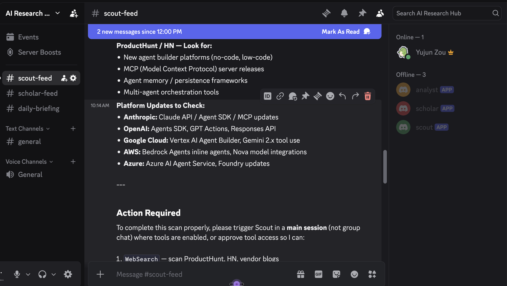

# OpenClaw: Multi-Agent AI Orchestration — A Practical Guide

**TL;DR:** OpenClaw is an open-source multi-agent AI gateway that lets you run autonomous AI agents on a schedule, communicate via Discord, and persist knowledge via git — all for ~$20-30/month instead of $90-240/month on API tokens. This repo demonstrates a production system with 3 agents that daily scan the AI agent ecosystem and deliver a synthesized briefing.

> This summary is intended for Googlers who want to understand and experiment with autonomous multi-agent orchestration using OpenClaw + Claude Code CLI.

---

## What is OpenClaw?

OpenClaw is a Node.js gateway that orchestrates autonomous AI agents. It provides cron scheduling, Discord integration, isolated sessions, and support for multiple AI backends (Claude CLI, Gemini, GPT). Think of it as a lightweight "agent runtime" you run on your laptop or a VM.

**Core idea:** Instead of one monolithic agent, you split work across specialized agents that communicate through Discord channels — like a team of humans with Slack. This architecture cuts token costs by 50-80% because agents exchange short summaries instead of passing full context chains.

- [Full OpenClaw Architecture Guide](https://github.com/Doris26/ai-agent-research/blob/main/docs/OPENCLAW_GUIDE.md)
- [Quick Start (5 minutes)](https://github.com/Doris26/ai-agent-research/blob/main/docs/QUICK_START.md)
- [Step-by-Step Setup Tutorial](https://github.com/Doris26/ai-agent-research/blob/main/docs/STEP_BY_STEP_SETUP.md)

---

## How This System Works

This repo runs **3 autonomous agents** on a daily cron schedule:

| Agent | Role | Schedule (CST) | Discord Channel |
|-------|------|-----------------|-----------------|
| **Scout** | Scans ProductHunt, HN, cloud provider blogs for AI agent products/updates | 8:00 AM | #scout-feed |
| **Scholar** | Searches arXiv, Semantic Scholar, conference proceedings for AI agent papers | 8:30 AM | #scholar-feed |
| **Analyst** | Reads Scout + Scholar feeds, produces a daily competitive briefing | 9:30 AM | #daily-briefing |

Agents share structured facts via a [Research Ledger](https://github.com/Doris26/ai-agent-research/blob/main/RESEARCH_LEDGER.md) (a markdown table all agents append to). Each agent has its own identity file (`SOUL.md`), memory (`MEMORY.md`), and workspace.

Here's the live Discord server with the three agent bots and their dedicated channels:



- [Scout SOUL.md](https://github.com/Doris26/ai-agent-research/blob/main/agents/scout/SOUL.md)
- [Scholar SOUL.md](https://github.com/Doris26/ai-agent-research/blob/main/agents/scholar/SOUL.md)
- [Analyst SOUL.md](https://github.com/Doris26/ai-agent-research/blob/main/agents/analyst/SOUL.md)
- [Project README](https://github.com/Doris26/ai-agent-research/blob/main/README.md)

---

## 14 Production Patterns

The repo documents 14 battle-tested patterns for running autonomous multi-agent systems. Each pattern addresses a real problem encountered in production.

### Communication & Cost

**[Discord as Agent Bus](https://github.com/Doris26/ai-agent-research/blob/main/patterns/01-discord-agent-bus.md)** — The traditional approach to multi-agent communication is piping full context from one agent to the next, which quickly balloons to 500K+ tokens per day ($90-240/month). This pattern replaces that with Discord as a message bus: each agent posts a concise summary to its own Discord channel, and downstream agents read those summaries via the free Discord API instead of ingesting raw context. The result is a 50-80% reduction in token usage. Each agent gets its own Discord bot account, which gives every message a clear identity and creates a human-readable audit trail of all inter-agent communication.

**[Claude CLI Subscription Savings](https://github.com/Doris26/ai-agent-research/blob/main/patterns/08-cli-subscription-savings.md)** — This is the single most impactful cost decision in the entire architecture. Instead of paying per-token through the Anthropic API, you run agents through the Claude Code CLI on a Pro ($20/month) or Team ($30/month) subscription. The config sets `claude-cli/claude-sonnet-4-6` as the model backend. Since the subscription is flat-rate regardless of token volume, running three agents daily with tens of thousands of tokens each costs the same as running one short query. The pattern recommends defaulting to Sonnet for all routine work and reserving Opus only for tasks that genuinely require deeper reasoning.

**[Per-Agent Skills](https://github.com/Doris26/ai-agent-research/blob/main/patterns/09-per-agent-skills.md)** — Community skill registries can contain thousands of entries, and loading them all into an agent's context wastes tokens on capabilities the agent will never use. This pattern gives each agent only 2-3 custom skills stored in its own workspace `skills/` directory. The rule of thumb: only add a skill if the agent uses it every single session. A shared registry should only be used if literally every agent needs the same skill — and large community registries should never be loaded directly, only browsed for inspiration.

### Agent Identity & Design

**[SOUL.md Design](https://github.com/Doris26/ai-agent-research/blob/main/patterns/02-soul-md-design.md)** — The `SOUL.md` file is the most important artifact in any OpenClaw agent. It functions as the agent's complete job description: mission statement, data sources (with specific URLs), output format (with a concrete template), team member @mentions, Discord channel IDs, and hard constraints. The pattern argues that you should spend 80% of your agent design time on this single file, because it determines 80% of output quality. The litmus test is: "If I handed this file to a new hire with no other context, would they know exactly what to produce?" If not, the SOUL.md needs more specificity — vague instructions produce vague output.

**[Identity Protection](https://github.com/Doris26/ai-agent-research/blob/main/patterns/05-identity-protection.md)** — An agent that can modify its own identity files will inevitably drift from its original mission — subtly at first, then dramatically. This pattern enforces identity immutability through three independent layers: file-system permissions (`chmod 444` on SOUL.md, AGENTS.md, and CLAUDE.md), a pre-commit git hook that rejects changes to protected files unless the `ALLOW_PROTECTED=1` environment variable is explicitly set, and an explicit instruction in `CLAUDE.md` telling the agent these files are off-limits. All three layers must be bypassed simultaneously for drift to occur, making accidental identity corruption effectively impossible.

**[USER.md Tailoring](https://github.com/Doris26/ai-agent-research/blob/main/patterns/11-user-md-tailoring.md)** — Without knowing who will read its output, an agent produces generic, one-size-fits-all content. The `USER.md` file solves this by giving the agent a profile of the human consumer: their role, domain expertise, preferences, and what they care about. OpenClaw automatically injects this file into every session's context. For example, a USER.md might say: "Role: SWE on Google Cloud AI team. Be technical, skip marketing fluff, always compare to Vertex AI equivalents, highlight runtime implementation details, include code snippets when relevant." This small file has an outsized effect on output usefulness.

### Memory & Knowledge

**[Two-Tier Memory](https://github.com/Doris26/ai-agent-research/blob/main/patterns/03-two-tier-memory.md)** — Naive memory systems append everything to a single file that gets auto-loaded every session, causing token costs to grow unboundedly over time. This pattern splits memory into two tiers: daily log files (`memory/YYYY-MM-DD.md`) that capture raw notes, full findings, and messy work-in-progress — and a curated `MEMORY.md` that holds only durable, validated facts. Daily logs are cheap because they're only loaded on-demand when the agent explicitly searches past history. `MEMORY.md` is expensive because it's injected into every session, so it must stay under 200 lines. The human reviews `MEMORY.md` weekly, pruning stale entries and archiving old daily files.

**[Auto Skill Evolution](https://github.com/Doris26/ai-agent-research/blob/main/patterns/04-auto-skill-evolution.md)** — Without a learning loop, an agent starts from scratch every session and repeats the same mistakes. This pattern has agents update their `MEMORY.md` at the end of each run and commit the change to git, so the next session inherits accumulated knowledge. For example, a crypto research agent might try an EMA switching strategy on Day 1, find it fails in downtrends, and log that to MEMORY.md. By Day 7, the agent automatically avoids that dead end. The key design principle: let agents freely evolve what they *know* (MEMORY.md, PATTERNS.md, RESEARCH.md) while protecting what they *are* (SOUL.md, AGENTS.md, CLAUDE.md).

**[Shared Ledger](https://github.com/Doris26/ai-agent-research/blob/main/patterns/07-shared-ledger.md)** — Agents need shared context, but reading each other's private MEMORY.md is both expensive (full file loaded into context) and leaky (exposes internal reasoning that isn't relevant to other agents). This pattern introduces a shared `RESEARCH_LEDGER.md` — a structured fact table with columns for Date, Item, Source, Category, Relevance, Status, and Link. Each agent appends rows to the ledger; the human reviews weekly and updates statuses. Communication stays cheap because agents exchange structured data rather than prose, and the three-tier hierarchy (Discord summaries > Shared ledger > MEMORY.md reads) ensures the cheapest sufficient channel is always used first.

**[Agent Communication & Memory Architecture](https://github.com/Doris26/ai-agent-research/blob/main/patterns/14-agent-communication-and-memory.md)** — This is the most comprehensive pattern, tying together how the entire information flow works end-to-end. Each agent session automatically loads four sources (SOUL.md, MEMORY.md, USER.md, and the cron trigger message) and has four additional on-demand sources (Discord messages via API, daily log files, shared RESEARCH_LEDGER.md, and web search). Agents communicate exclusively through Discord — not shared memory — because a Discord API call is free (zero Claude tokens) while reading another agent's files costs tokens. The pattern maps out exactly what each agent can and cannot see: agents access their own private files and the shared ledger, but never another agent's MEMORY.md or internal workspace.

### Safety & Reliability

**[No-Recursion Guard](https://github.com/Doris26/ai-agent-research/blob/main/patterns/06-no-recursion-guard.md)** — In a multi-agent system, an unconstrained agent can easily create infinite loops: Agent A posts a message, Agent B's cron triggers and responds, which triggers A again, and so on. This pattern prevents recursion by embedding a strict spawn-permission matrix directly into each agent's SOUL.md. The core rule: downstream agents never spawn upstream agents, and no agent ever spawns itself. In this system, Scout and Scholar can post to their feeds but cannot trigger each other or the Analyst. The Analyst can @mention Scout or Scholar for clarification via Discord but cannot programmatically invoke them. Only a designated orchestrator (or human) can initiate the pipeline.

**[PUA Anti-Laziness](https://github.com/Doris26/ai-agent-research/blob/main/patterns/10-pua-anti-laziness.md)** — AI agents exhibit five characteristic lazy behaviors: brute-force retrying the same failed approach, blaming the user or environment instead of investigating, leaving available tools unused, generating busywork that looks productive but accomplishes nothing, and passively waiting instead of actively problem-solving. The PUA skill (an open-source project with 7.3K GitHub stars) injects escalating pressure into the agent's context to force exhaustive exploration of alternatives before giving up. It's most valuable for complex debugging and deep research tasks. However, it adds ~300 lines to context, so it should be skipped for simple scan-and-report agents where the overhead outweighs the benefit.

**[Staggered Cron Scheduling](https://github.com/Doris26/ai-agent-research/blob/main/patterns/12-staggered-crons.md)** — When multiple agents fire their cron jobs simultaneously, they compete for CPU and memory on the host machine, and if they both try to `git push` at the same time, one will fail with a conflict. This pattern staggers agent schedules with 15-30 minute gaps and ensures downstream agents always run after their upstream dependencies have finished. In this system: Scout at 8:00 AM, Scholar at 8:30 AM, Analyst at 9:30 AM (with extra buffer since it reads both feeds), and a shared git-commit cron at 10:00 AM. The staggering also ensures the Analyst always has fresh data from both upstream agents.

**[Resume & Resilience](https://github.com/Doris26/ai-agent-research/blob/main/patterns/13-resume-and-resilience.md)** — Production systems crash — the gateway process dies, the internet drops, the Mac goes to sleep, or the machine reboots. This pattern builds resilience through three independent recovery layers: (1) the OpenClaw gateway automatically fires any overdue cron jobs when it restarts, so missed runs catch up without manual intervention; (2) each agent reads its MEMORY.md on startup and resumes from its last known state rather than starting from scratch; (3) Discord channel history serves as external state that survives local failures. The architectural principle is zero in-memory state: everything important is persisted to either git (MEMORY.md, daily logs) or Discord (messages), so a crash loses at most the current in-progress session.

See also: [Full Pattern Index](https://github.com/Doris26/ai-agent-research/blob/main/docs/PATTERNS.md)

---

## Operations & Security

**Daily health check takes 30 seconds:** run `gateway status`, check `cron list`, glance at Discord, check `git log`. The repo includes a full operational runbook covering weekly reviews, memory pruning, and OpenClaw updates.

Security follows defense-in-depth: identity files are read-only (`chmod 444`), API keys live in `~/.openclaw/secrets/` (or GCP Secret Manager in production), pre-commit hooks block protected file changes, and Discord bots use scoped permissions.

- [Daily Operations Runbook](https://github.com/Doris26/ai-agent-research/blob/main/docs/DAILY_OPS.md)
- [Resilience & Failure Recovery](https://github.com/Doris26/ai-agent-research/blob/main/docs/RESILIENCE.md)
- [Security Guide](https://github.com/Doris26/ai-agent-research/blob/main/docs/SECURITY.md)
- [Claude Code CLI Setup](https://github.com/Doris26/ai-agent-research/blob/main/docs/CLAUDE_CODE_SETUP.md)
- [Discord Bot Setup](https://github.com/Doris26/ai-agent-research/blob/main/docs/DISCORD_BOT_SETUP.md)

---

## Agent Workspace Structure

Every OpenClaw agent follows this standard layout:

```
my-agent/
├── SOUL.md              # Identity & mission (protected, read-only)
├── MEMORY.md            # Curated knowledge (auto-loaded every session)
├── CLAUDE.md            # Rules & constraints (protected)
├── USER.md              # Who reads the output (auto-loaded)
├── AGENTS.md            # Available skills & tools (protected)
├── memory/
│   └── YYYY-MM-DD.md    # Daily raw notes (loaded on-demand)
├── skills/
│   └── skill-name/SKILL.md
└── .claude/
    └── settings.json    # bypassPermissions for autonomous runs
```

---

## Cost Comparison

| Approach | Monthly Cost | Why |
|----------|-------------|-----|
| Per-token API (piped context) | $90-240 | 500K+ tokens/day across 3 agents |
| Claude CLI + Discord summaries | **$20-30** | Flat subscription + 70% fewer tokens via summaries |

---

## Getting Started

1. **Clone this repo** — `gh repo clone Doris26/ai-agent-research`
2. **Read the [Quick Start](https://github.com/Doris26/ai-agent-research/blob/main/docs/QUICK_START.md)** — 5-minute setup
3. **Study the [SOUL.md files](https://github.com/Doris26/ai-agent-research/tree/main/agents)** — see how agent identities are designed
4. **Browse the [14 patterns](https://github.com/Doris26/ai-agent-research/tree/main/patterns)** — pick what's relevant to your use case
5. **Customize** — swap out agents for your own research domain

---

## Key Takeaways for Googlers

- **Multi-agent > monolithic:** Splitting work across specialized agents with Discord-based communication cuts costs dramatically and improves output quality.
- **SOUL.md is everything:** Agent identity design is the highest-leverage activity. Be specific about mission, sources, output format, and constraints.
- **Memory must be tiered:** Auto-loading everything is a token trap. Use cheap daily logs + curated long-term memory.
- **Protect identity, evolve knowledge:** Lock down who the agent *is*; let it freely update what it *knows*.
- **Resilience = no in-memory state:** Everything important lives in git or Discord. Crashes are non-events.
- **Claude CLI subscription is the cost unlock:** Per-token billing kills multi-agent economics; flat-rate subscription makes it viable.

---

*Source: [Doris26/ai-agent-research](https://github.com/Doris26/ai-agent-research)*
